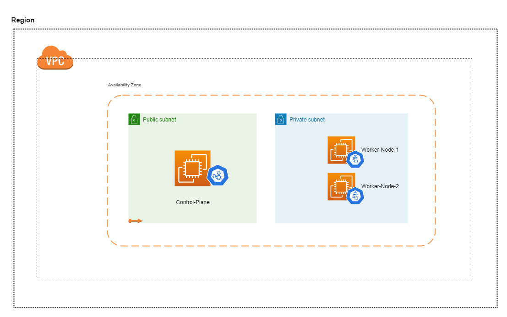

# Complete K8S Cluster with Terraform and Ansible
 An automated approach to create a Kubernetes cluster on AWS with use of Terraform and Ansible.

This will provision a Kubernetes cluster on AWS with the control node and two worker nodes. Solution has been done using Terraform and Ansible.

Terraform gets help of below repository to configure the Kuberenetes cluster with Ansible
 
https://github.com/dulanjanad/Configure-K8S-Cluster-with-Ansible

Steps to follow

1). Clone the repository

     git clone ..
     
2). Make sure to do the desired changes for the variables (Specially current_public_ip with current public IP address of yours)

3). Terraform commands to run
   
     terraform init
     terraform fmt
     terraform validate
     terraform terraform plan
     terraform apply -auto-approve
     
 Well that's really it, now sit and wait. Cluster will be ready within 5-6 mins. :wink:
     
> :warning: **Warning:** This provsions a t3.medium ec2 instance as control-plane and a NAT Gateway within the VPC. Even if you are using a AWS free-tier still costs will be included.

#### Overview of the resources after deployed

